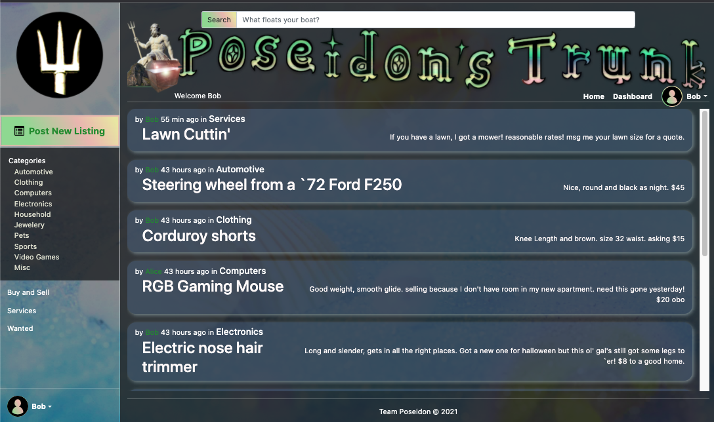

# Project-Poseidon
                        

## Description
Create a User, login and post to your hearts content. This Express.js server hosts an API for database calls, as well as serving up a fully featured front end.  

Screenshot: \

Live Demo:
https://project-team-poseidon.herokuapp.com/

## Table of Contents

* [Description](#description)
* [Table of Contents](#table-of-contents)
* [Installation](#installation)
* [Usage](#usage)
* [Contributing](#contributing)
* [License](#license)

## Installation

This project requires that Node.js be installed on the target machine and that the user has write access to a MySQL server.  
1. Copy the repository files and then run `npm i` to install all required dependencies.  
2. In the root directory, create and edit a `.env` file (see Fig.1 below) to reflect the login credentials required to access your MySQL server. 
3. Open the `./config/connection.js` file in your favorite text editor and set the sequelize settings for `host`,`dialect`, and `port` as needed to connect to your SQL server.
4. Login to your MySQL server and `CREATE DATABASE poseidons_trunk_db` then logout.  
5. (optional) To seed the database with testing data type `npm run seed` 

Fig.1

## Usage

Once the project has been installed and configured as outlined above, you can run the server by typing `node server.js` or `npm start`.  
Then navigate to the network path:port of the server and browse the posts or create an account and your all set.  

## Contributing

Any contributions are welcome. Just fork the project, test any code you add and request a merge!  
   
## License

MIT License

Copyright (c) 2021 TEAM POSEIDON

Permission is hereby granted, free of charge, to any person obtaining a copy
of this software and associated documentation files (the "Software"), to deal
in the Software without restriction, including without limitation the rights
to use, copy, modify, merge, publish, distribute, sublicense, and/or sell
copies of the Software, and to permit persons to whom the Software is
furnished to do so, subject to the following conditions:

The above copyright notice and this permission notice shall be included in all
copies or substantial portions of the Software.

THE SOFTWARE IS PROVIDED "AS IS", WITHOUT WARRANTY OF ANY KIND, EXPRESS OR
IMPLIED, INCLUDING BUT NOT LIMITED TO THE WARRANTIES OF MERCHANTABILITY,
FITNESS FOR A PARTICULAR PURPOSE AND NONINFRINGEMENT. IN NO EVENT SHALL THE
AUTHORS OR COPYRIGHT HOLDERS BE LIABLE FOR ANY CLAIM, DAMAGES OR OTHER
LIABILITY, WHETHER IN AN ACTION OF CONTRACT, TORT OR OTHERWISE, ARISING FROM,
OUT OF OR IN CONNECTION WITH THE SOFTWARE OR THE USE OR OTHER DEALINGS IN THE
SOFTWARE.
                 

     
